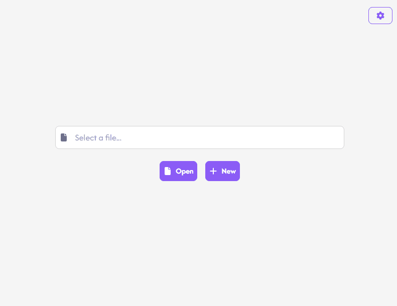

# Passmage - Simple password manager

A simple, secure and user-friendly password manager built with Tauri and React.



## Features

- Generate strong passwords and passphrases
- Copy passwords to clipboard with a single click or with Ctrl+C
- Search through entries quickly with Ctrl+K
- Modern, clean interface
- Secure storage of credentials
- Cross-platform desktop application

## Tech Stack

- [Tauri](https://tauri.app/) - Desktop application framework
- [React](https://reactjs.org/) - UI framework
- [TypeScript](https://www.typescriptlang.org/) - Type-safe JavaScript
- [Tailwind CSS](https://tailwindcss.com/) - Utility-first CSS framework
- [FontAwesome](https://fontawesome.com/) - Icons

## Installation

You can download the latest release [here](https://github.com/matteoauger/passmage/releases).

## Development

### Prerequisites

- Node.js
- Rust
- Tauri CLI

### Getting Started

1. Clone the repository:

```bash
git clone https://github.com/matteoauger/passmage.git
```

2. Install dependencies:

```bash
npm install
```

3. Run the development server:

```bash
npm run tauri dev
```

## License

This project is licensed under the MIT License. See the [LICENSE](LICENSE.md) file for details.
